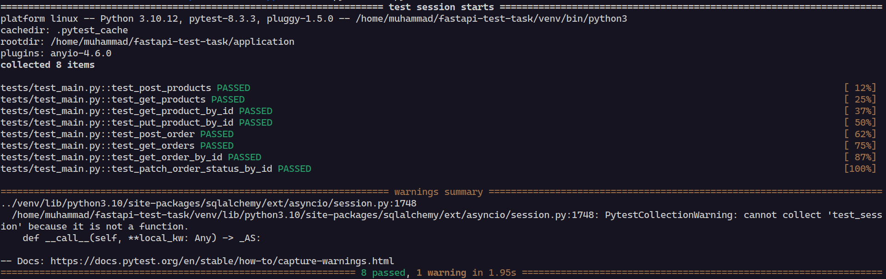

# Warehold

Тестовое задание в Effective Mobile: REST API с использованием FastAPI для управления процессами на складе.

## Установка

Создайте файл `prod.env` если для докера и `.env` если для локального развертывания (можно оба одновременно) и вставьте туда переменные окружения от вашего PostgreSQL, например (.env, для локального):
```bash
DB_HOST=localhost # DB_HOST=db (для компоуз файла этого репозитория)
DB_PORT=5432
DB_USER=postgres
DB_PASS=postgres
DB_NAME=db
```

Примечание: `DB_HOST` должен соответствовать названию нетворка в `docker-compose.yml` в `prod.env`, для локального развертывания по умолчанию `localhost`

### Docker Compose
Запуск контейнеров:
```bash
docker-compose up --build
```
### Локальный запуск 
Создаем окружение, устанавливаем зависимости:
```bash
python3 -m venv venv
source venv/bin/activate
pip install -r requirements.txt
```

Создаем бд скриптом, запускаем сервер:
```bash
cd application
python3 create_db.py
uvicorn main:app --reload
```


## Тесты

Для запуска тестов необходимо создать бд "test" и инициализировать таблицы:
```bash
cd application
python3 init_test_db.py
``` 

Запуск pytest (флажок -v дает более подробную информацию):
```bash
python3 -m pytest -v
```

Результат локального запуска:




## Дальнейшие улучшения
- Расширить набор HTTP статус кодов от методов
- Сделать автоматическую инициализацию бд в рамках асинк тестов (сейчас ручной запуск .py скрипта)
- Реализовать бэкапы бд

## Ресурсы

Страницы/видео, которые помогли при выполнении данного тестового задания:
1. [Документация FastAPI](https://fastapi.tiangolo.com/)
2. [Building a REST API with FastAPI, Async SQLAlchemy, and PostgreSQL](https://www.youtube.com/watch?v=nC9ob8xM3AM)
3. [Канал Артема Шумейко](https://www.youtube.com/@artemshumeiko)
4. [Документация тестинга с AnyIO](https://anyio.readthedocs.io/en/stable/testing.html#specifying-the-backends-to-run-on)
5. [Документация SQLAlchemy 2.0](https://docs.sqlalchemy.org/en/20/index.html)
